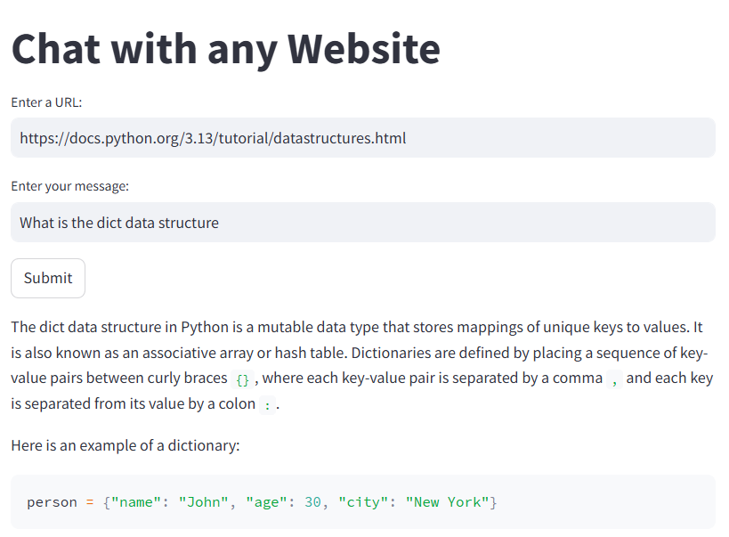

# Chat with Any Website

This project allows users to chat with any website by extracting content from the provided URL and processing it with an AI model using **Groq Cloud**'s API. The application is built with **Streamlit** for the frontend and **LangChain** for integrating the language model.



## Prerequisites

Before running the application, you need to make sure you have the following:

- **Python 3.8+**
- **An active account on GroqCloud** to get your **API Key**.

## Setup Instructions

### 1. Create a Python Virtual Environment

First, navigate to your project directory in the terminal or command prompt.

#### **Create the virtual environment:**
- On macOS/Linux:
```bash
python3 -m venv venv
```
- On Windows:
```bash
python -m venv venv
```
#### **Activate the virtual environment:**
- On macOS/Linux:
  ```bash
  source venv/bin/activate
  ```
- On Windows:
  ```bash
  venv\Scripts\activate
  ```

### 2. Install Dependencies

Once your virtual environment is activated, install the required Python dependencies from the `requirements.txt` file.

```bash
pip install -r requirements.txt
```

### 3. Set Up Your GroqCloud API Key

You need an API key from **GroqCloud** to use the Groq API. To get your key:

1. Sign up for an account on [GroqCloud](https://groq.com).
2. After logging in, find your API key in the account settings.

Once you have the key, proceed to the next step.

### 4. Configure Your Environment Variables

Create a `.env` file in your project directory and add your GroqCloud API Key:

```bash
GROQ_API_KEY=your_api_key_here
```

Make sure to replace `your_api_key_here` with the actual API key you obtained from GroqCloud.

### 5. Run the Application with Streamlit

To launch the web application, use **Streamlit**. In your terminal, run:

```bash
streamlit run main.py
```

This will start the Streamlit server, and you should be able to open the application in your web browser.

### 6. Interact with the Application

- **Enter a URL**: Provide the URL of the website you want to chat with.
- **Enter your message**: Type in a query or message to ask about the website content.
- **Click Submit**: The app will extract data from the website and return a response based on your query.

---

## Project Structure

```
.
├── main.py               # Main Streamlit app to interact with the website
├── chat.py               # Contains logic for extracting and responding to user queries
├── utils.py              # Utility functions (like `clean_text` for cleaning extracted data)
├── requirements.txt      # List of required Python packages
├── .env                  # Environment file for API keys
└── README.md             # This readme file
```

## Dependencies in `requirements.txt`

Make sure to have the following dependencies listed in your `requirements.txt` file:

```
streamlit
langchain-groq
langchain-core
langchain-community
python-dotenv
```

## Troubleshooting

- **Issue with `GROQ_API_KEY` not being loaded**: Ensure you have a valid `.env` file in your project directory and the key is correct.
- **Installation issues**: Make sure all dependencies are installed by running `pip install -r requirements.txt` again.
